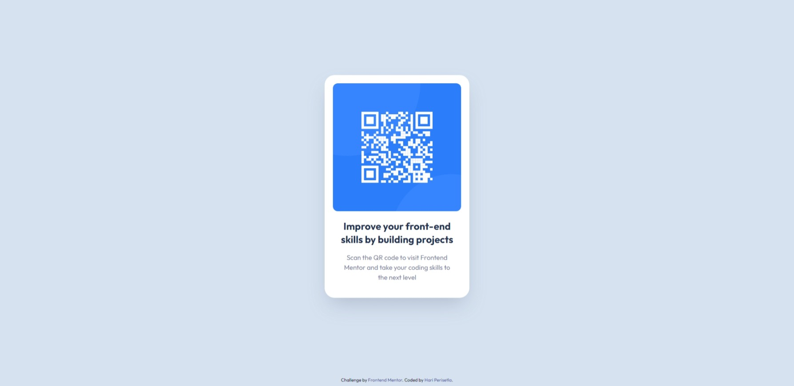

# Frontend Mentor - QR code component solution

This is a solution to the [QR code component challenge on Frontend Mentor](https://www.frontendmentor.io/challenges/qr-code-component-iux_sIO_H). Frontend Mentor challenges help you improve your coding skills by building realistic projects.

## Table of contents

- [Overview](#overview)
  - [Screenshot](#screenshot)
  - [Links](#links)
- [My process](#my-process)
  - [Built with](#built-with)
- [Author](#author)

## Overview

### Screenshot

### Links

- Solution URL: [Go to Repo](https://github.com/hariperisetla/qr-code-component-using-tailwind-css)
- Live Site URL: [Go to Live Site](https://hariperisetla.github.io/qr-code-component-using-tailwind-css)

## My process

### Built with

- HTML5
- CSS
- Tailwind CSS

## Author

- Website - [Hari Perisetla](https://www.hariperisetla.netlify.com)
- Frontend Mentor - [@hariperisetla](https://www.frontendmentor.io/profile/hariperisetla)
- Twitter - [@hariperisetla](https://www.twitter.com/hariperisetla)
